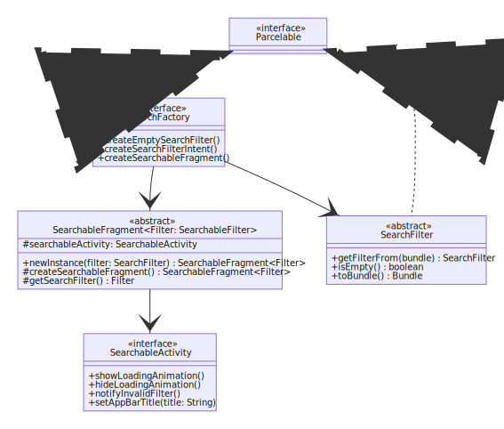

# Decoupled Android Search

I was working on a project where we had to support a couple of features regarding searching different resources. Although the ways of searching and displaying the resources were very different, I was able to come up with a solution, based on a classic design pattern, to reuse some common UI features that had to be consistent between them.

In this article I show a very simple app that support searching dogs and animes in order to present my solution.

| Dog search                           | Anime Search                             |
|--------------------------------------|------------------------------------------|
|  |  |

We can see that the two features presented above are very different, but I'm going to list some common behaviours between them:

* A "search results screen" where the user can scroll and see the results it's search:
	* The app bar changes according to the search parameters chosen by the user;
	* There is a loading animation (a `SwipeRefreshLayout` on the images above);
	* A "invalid filter" warning if the user choses a invalid search parameters combination, e.g. an empty search (not shown above);
	* A `View` that redirects to the "filter screen" (represented as the `FloatingActionButton` above) passing the current filter.
* A "filter screen" where the user can choose the search parameters:
	* Should display the current filter so the user can edit it;
	* The search filter chosen by the user is sent back to the "search results screen";
	* Is the first screen shown to the user when opening a search feature.

[](https://mermaid-js.github.io/mermaid-live-editor/#/edit/eyJjb2RlIjoiY2xhc3NEaWFncmFtXG5cbiAgY2xhc3MgU2VhcmNoRmFjdG9yeSB7XG4gICAgPDxpbnRlcmZhY2U-PlxuICAgICtjcmVhdGVFbXB0eVNlYXJjaEZpbHRlcigpOiBTZWFyY2hGaWx0ZXJcbiAgICArY3JlYXRlU2VhcmNoRmlsdGVySW50ZW50KCk6IEludGVudFxuICAgICtjcmVhdGVTZWFyY2hhYmxlRnJhZ21lbnQoKTogU2VhcmNoYWJsZUZyYWdtZW50PFNlYXJjaEZpbHRlcj5cbiAgfVxuXG4gIGNsYXNzIFNlYXJjaGFibGVBY3Rpdml0eSB7XG4gICAgPDxpbnRlcmZhY2U-PlxuICAgICtzaG93TG9hZGluZ0FuaW1hdGlvbigpXG4gICAgK2hpZGVMb2FkaW5nQW5pbWF0aW9uKClcbiAgICArbm90aWZ5SW52YWxpZEZpbHRlcigpXG4gICAgK3NldEFwcEJhclRpdGxlKHRpdGxlOiBTdHJpbmcpXG4gIH1cblxuICBjbGFzcyBTZWFyY2hhYmxlRnJhZ21lbnR-RmlsdGVyOiBTZWFyY2hhYmxlRmlsdGVyfntcbiAgICA8PGFic3RyYWN0Pj5cbiAgICAjc2VhcmNoYWJsZUFjdGl2aXR5OiBTZWFyY2hhYmxlQWN0aXZpdHlcblxuICAgICtuZXdJbnN0YW5jZShmaWx0ZXI6IFNlYXJjaEZpbHRlcikgU2VhcmNoYWJsZUZyYWdtZW50fkZpbHRlcn5cbiAgICAjY3JlYXRlU2VhcmNoYWJsZUZyYWdtZW50KCkqIFNlYXJjaGFibGVGcmFnbWVudH5GaWx0ZXJ-XG4gICAgI2dldFNlYXJjaEZpbHRlcigpIEZpbHRlclxuICB9XG5cbiAgY2xhc3MgU2VhcmNoRmlsdGVyIHtcbiAgICA8PGFic3RyYWN0Pj5cbiAgICArZ2V0RmlsdGVyRnJvbShidW5kbGUpJCBTZWFyY2hGaWx0ZXJcbiAgICAraXNFbXB0eSgpKiBib29sZWFuXG4gICAgK3RvQnVuZGxlKCkqIEJ1bmRsZVxuICB9XG4gIFxuICBjbGFzcyBQYXJjZWxhYmxlIHtcbiAgICA8PGludGVyZmFjZT4-XG4gIH1cblxuICBQYXJjZWxhYmxlIDx8Li4gU2VhcmNoRmFjdG9yeVxuICBQYXJjZWxhYmxlIDx8Li4gU2VhcmNoRmlsdGVyXG4gIFNlYXJjaEZhY3RvcnkgLS0-IFNlYXJjaGFibGVGcmFnbWVudFxuICBTZWFyY2hGYWN0b3J5IC0tPiBTZWFyY2hGaWx0ZXJcbiAgXG4gIFNlYXJjaGFibGVGcmFnbWVudCAtLT4gU2VhcmNoYWJsZUFjdGl2aXR5XG5cdFx0XHRcdFx0IiwibWVybWFpZCI6eyJ0aGVtZSI6ImRlZmF1bHQifSwidXBkYXRlRWRpdG9yIjpmYWxzZX0)

