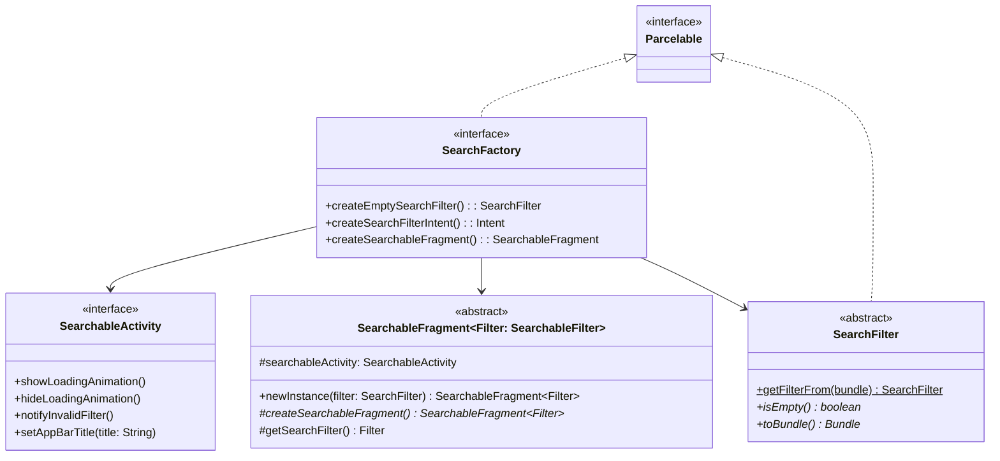

<!---

```mermaid
classDiagram

  class SearchFactory {
    <<interface>>
    +createEmptySearchFilter(): SearchFilter
    +createSearchFilterIntent(): Intent
    +createSearchableFragment(): SearchableFragment<SearchFilter>
  }

  class SearchableActivity {
    <<interface>>
    +showLoadingAnimation()
    +hideLoadingAnimation()
    +notifyInvalidFilter()
    +setAppBarTitle(title: String)
  }

  class SearchableFragment~Filter: SearchableFilter~{
    <<abstract>>
    #searchableActivity: SearchableActivity

    +newInstance(filter: SearchFilter) SearchableFragment~Filter~
    #createSearchableFragment()* SearchableFragment~Filter~
    #getSearchFilter() Filter
  }

  class SearchFilter {
    <<abstract>>
    +getFilterFrom(bundle)$ SearchFilter
    +isEmpty()* boolean
    +toBundle()* Bundle
  }
  
  class Parcelable {
    <<interface>>
  }

  Parcelable <|.. SearchFactory
  Parcelable <|.. SearchFilter
  SearchFactory --> SearchableActivity
  SearchFactory --> SearchableFragment
  SearchFactory --> SearchFilter
```
-->

